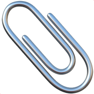

<!-- Improved compatibility of back to top link: See: https://github.com/othneildrew/Best-README-Template/pull/73 -->

<!--
*** Thanks for checking out the Best-README-Template. If you have a suggestion
*** that would make this better, please fork the repo and create a pull request
*** or simply open an issue with the tag "enhancement".
*** Don't forget to give the project a star!
*** Thanks again! Now go create something AMAZING! :D
-->

<!-- PROJECT SHIELDS -->
<!--
*** I'm using markdown "reference style" links for readability.
*** Reference links are enclosed in brackets [ ] instead of parentheses ( ).
*** See the bottom of this document for the declaration of the reference variables
*** for contributors-url, forks-url, etc. This is an optional, concise syntax you may use.
*** https://www.markdownguide.org/basic-syntax/#reference-style-links
-->
[![Contributors][contributors-shield]][contributors-url]
[![Forks][forks-shield]][forks-url]
[![Issues][issues-shield]][issues-url]
[![LinkedIn][linkedin-shield]][linkedin-url]

<!-- PROJECT LOGO -->
 

  

<h3 align="center">Clipster</h3>

  

    A small clipboard manager
     
    <a href="https://github.com/TacoCatDev/Clipster"><strong>Explore the docs »</strong></a>
     
     
    <a href="https://github.com/TacoCatDev/Clipster">View Demo</a>
    ·
    <a href="https://github.com/TacoCatDev/Clipster/issues">Report Bug</a>
    ·
    <a href="https://github.com/TacoCatDev/Clipster/issues">Request Feature</a>
  

<!-- TABLE OF CONTENTS -->

  
Table of Contents

  <ol>
    <li>
      <a href="#about-the-project">About The Project</a>
      <ul>
        <li><a href="#built-with">Built With</a></li>
      </ul>
    </li>
    <li>
      <a href="#getting-started">Getting Started</a>
      <ul>
        <li><a href="#installation">Installation</a></li>
      </ul>
    </li>
    <li><a href="#usage">Usage</a></li>
    <li><a href="#roadmap">Roadmap</a></li>
    <li><a href="#contributing">Contributing</a></li>
    <li><a href="#contact">Contact</a></li>
  </ol>

<!-- ABOUT THE PROJECT -->
## About The Project

<!--[![Product Name Screen Shot][product-screenshot]](https://example.com)-->
Clipster is a simple lightweight clipboard management app for programmers, students or anyone that likes a clipboard history. This also serves as an example of swiftUI implementation as I learn it moving from storyboarding. Just a small project I started working on because I wanted to have something small and simple.

(<a href="#readme-top">back to top</a>)

### Built With
Xcode and swiftUI

(<a href="#readme-top">back to top</a>)

<!-- GETTING STARTED -->
## Getting Started

In order to use Clipster, you will have to follow some simple steps. 

### Installation

1. Go to the releases tab.
2. Download the lastest release app file.
3. Once downloaded, drag and drop the app into your Applications Folder.
4. Apple will provide you with a warning for downloading an unsiged application, dismiss it and go to preferences.
5. In preferences go to Security and Privacy.
6. Click on "Open Anyway"

(<a href="#readme-top">back to top</a>)

<!-- USAGE EXAMPLES -->
## Usage

Once the app is running, simply copy anything you want, and clipster will keep a history for you. To recover something you copied, simply click on the 
item you would like to put back into your pasteboard.

  
  

***_For more examples, please refer to the [Documentation](https://example.com)_

(<a href="#readme-top">back to top</a>)

<!-- ROADMAP -->
## Roadmap

- [X] User defined preview length (Just not updating unless on next open)
- [ ] Change how the clipboard updates and triggers events, rather than just check it on a timer
- [ ] User defined commands for pasting strings by using cmd + 1, cmd + 2 etc
- [ ] Handle images, videos, ect
- [ ] Major UI Overhaul

See the [open issues](https://github.com/github_username/repo_name/issues) for a full list of proposed features (and known issues).

(<a href="#readme-top">back to top</a>)

<!-- CONTRIBUTING -->
## Contributing

Contributions are what make the open source community such an amazing place to learn, inspire, and create. Any contributions you make are **greatly appreciated**.

If you have a suggestion that would make this better, please fork the repo and create a pull request. You can also simply open an issue with the tag "enhancement".
Don't forget to give the project a star! Thanks again!

1. Fork the Project
2. Create your Feature Branch (`git checkout -b feature/AmazingFeature`)
3. Commit your Changes (`git commit -m 'Add some AmazingFeature'`)
4. Push to the Branch (`git push origin feature/AmazingFeature`)
5. Open a Pull Request

(<a href="#readme-top">back to top</a>)

<!-- CONTACT -->
## Contact

Ethan Jamieson - [@eefernet](https://twitter.com/eefernet) - ethan@eefernet.com

Project Link: [https://github.com/TacoCatDev/Clipster](https://github.com/TacoCatDev/Clipster)

(<a href="#readme-top">back to top</a>)

<!-- MARKDOWN LINKS & IMAGES -->
<!-- https://www.markdownguide.org/basic-syntax/#reference-style-links -->
[contributors-shield]: https://img.shields.io/github/contributors/TacoCatDev/Clipster.svg?style=for-the-badge
[contributors-url]: https://github.com/TacoCatDev/Clipster/graphs/contributors
[forks-shield]: https://img.shields.io/github/forks/TacoCatDev/Clipster.svg?style=for-the-badge
[forks-url]: https://github.com/TacoCatDev/Clipster/network/members
[stars-shield]: https://img.shields.io/github/stars/TacoCatDev/repo_name.svg?style=for-the-badge
[stars-url]: https://github.com/github_username/repo_name/stargazers
[issues-shield]: https://img.shields.io/github/issues/TacoCatDev/Clipster.svg?style=for-the-badge
[issues-url]: https://github.com/TacoCatDev/clipster/issues
[license-shield]: https://img.shields.io/github/license/github_username/repo_name.svg?style=for-the-badge
[license-url]: https://github.com/github_username/repo_name/blob/master/LICENSE.txt
[linkedin-shield]: https://img.shields.io/badge/-LinkedIn-black.svg?style=for-the-badge&logo=linkedin&colorB=555
[linkedin-url]: https://linkedin.com/in/ethan-jamieson-42233ba6
[product-screenshot]: images/screenshot.png
[Next.js]: https://img.shields.io/badge/next.js-000000?style=for-the-badge&logo=nextdotjs&logoColor=white
[Next-url]: https://nextjs.org/
[React.js]: https://img.shields.io/badge/React-20232A?style=for-the-badge&logo=react&logoColor=61DAFB
[React-url]: https://reactjs.org/
[Vue.js]: https://img.shields.io/badge/Vue.js-35495E?style=for-the-badge&logo=vuedotjs&logoColor=4FC08D
[Vue-url]: https://vuejs.org/
[Angular.io]: https://img.shields.io/badge/Angular-DD0031?style=for-the-badge&logo=angular&logoColor=white
[Angular-url]: https://angular.io/
[Svelte.dev]: https://img.shields.io/badge/Svelte-4A4A55?style=for-the-badge&logo=svelte&logoColor=FF3E00
[Svelte-url]: https://svelte.dev/
[Laravel.com]: https://img.shields.io/badge/Laravel-FF2D20?style=for-the-badge&logo=laravel&logoColor=white
[Laravel-url]: https://laravel.com
[Bootstrap.com]: https://img.shields.io/badge/Bootstrap-563D7C?style=for-the-badge&logo=bootstrap&logoColor=white
[Bootstrap-url]: https://getbootstrap.com
[JQuery.com]: https://img.shields.io/badge/jQuery-0769AD?style=for-the-badge&logo=swift&logoColor=white
[JQuery-url]: https://jquery.com 

